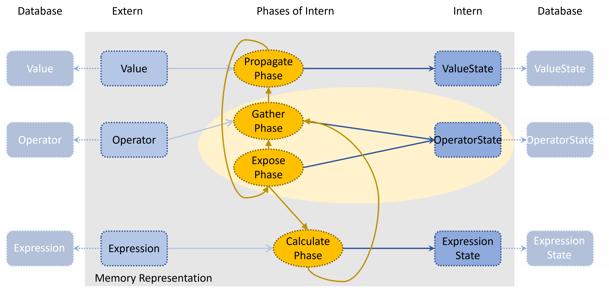
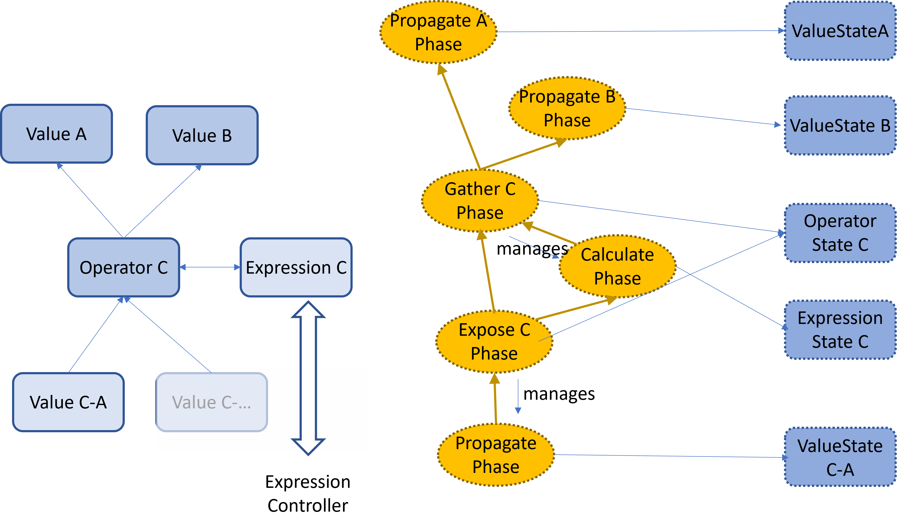

## An Egine to process Flow Graphs described by Resource Manifests

This project provides a controller working on an
object space, which processes a flow graph described by resource
objects stored in the object space.

The graph is an instance of a graph metamodel, which is passed
to the controller. The controller itself provides a metamodel
used to describe graph metamodels.


A graph metamodel defines the node types (whose instances
are stored in the object space) and the potential dependencies
among instances of such types.

A concrete model with dedicated instances, their types and
dependencies is then stored in the objectspace.

The processing is based on a model of shadow elements, which
implement the concrete processing steps.
They are wrapping persistent objects stored in the object space.

There are the user facing defining object types (external objects),
which describe the desired state of the processing graph.

Every external object is typically shadowed by an internal (state) 
object, which keeps the processing state.

On top of those persistent objects, the programming
model uses implementation objects, which must be provided 
by an implementation of the graph metamodel.
Those objects are instantiated by the engine in memory and must implement
the engine interface. They are used by the engine to provide
standardized information, like the external desired state,
or the dependency information. And they execute the payload
related processing steps. The flow control is completely done
by engine. 


The processing of an internal object is divided into one or more
processing phases. Every phase has the same interface towards the
engine:
- provide current state
- accepting target state from a triggering external object
- providing dependency information according to current and target
  state
- providing a processing step (which might provide incremental progress)
- providing an output state after successful processing.

The engine then handles the dataflow among the
processing graph defined by the current and target state
of the phases and their dependencies. The output of input dependencies
is provided to the processing, and if it is successful the output
of the processing is again used as input for dependent phases.

Every external object has an assigned internal object (which is created by engine on demand), which handles the concrete processing.
Therefore, changes on the external object trigger the processing of
a phase of the internal object. Multiple phases might be provided
by the internal object, which feature different dependencies.

Thereby, three kinds of relations between an external and
an internal (state carrying) objects are supported:
1) Every external object is used to control the life-cycle of
  the internal one
2) An external object is controlled by a phase of an internal object.
3) A phase of an internal object may create other internal objects
  with dependencies of successor phases of the internal object.

### Testing

The project includes a filesystem-based implementation
of an objectspace. Additionally, a web server is included,
which can be used to access and manipulate the objectspace.

It can be started with the `engine` command. By default,
it is linked with an implemention of the sample metamodel
provided by this project.

With the command `ectl` resource objects can be retrieved and applied.

Both commands can be installed with `make install`.


### Example metamodel

The project come with an example metamodel describing a simple
calculator.



It describes Value objects (case 1) usable as operands for Operator
objects. 

The operator manages an expression object responsible
for  the execution of the operation. This object is processed by a
dedicated  expression controller. The opertor just gather the 
operands, creates an expression object (case 3), waits for the result
(case 2) and provides the output to described output value object (case 3).

The concrete implementation uses an expression controller, which now 
may create again sub processing graphs to calculate more complex
expressions like A*B+C.

An example for a concrete model based on this metamodel is shown here:



#### Running the example

First, start the engine with

```shell
engine engine -d local/db -F ./ui -P /watch -c -D 1s
```

Adding the option `-L debug` will provide more logging output.
With `-D 1s` it is possible to slow down the processing to observe
the processing flow. With a web browser the URL
`http://localhost:8080/ui` starts a simple visualization of the
processing based on the phases can be seen.

The folder `scenarios` contains some example scenarios
which can be deployed using

```shell
ectl apply -f *.yaml
```

With 
```shell
ectl get -c 
ectl get Value
```

it is possible to display the involved objects and their state.


